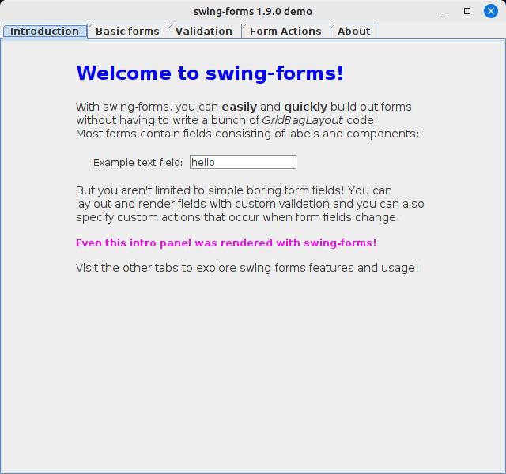
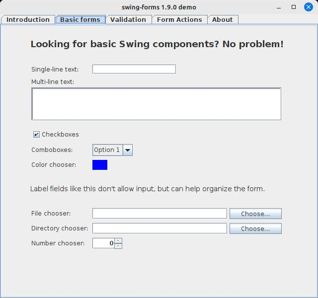
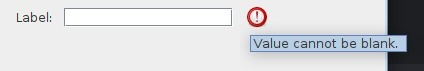
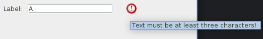
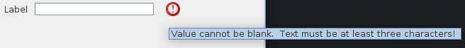
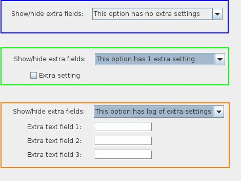
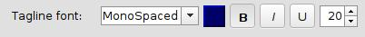

# swing-forms

This is swing-forms, a simple Java Swing library I originally wrote back in 2019 for use in various
side projects. It's proven useful to me a few times, mainly in saving me from having to write a lot
of manual GridBagLayout code, which I hate. With swing-forms you can very quickly stand up a form
with optional validation rules and with customizable Actions on each form field.

## Where do I get it?
With Maven, you can just list it as a dependency:

```xml
<dependencies>
  <dependency>
    <groupId>ca.corbett</groupId>
    <artifactId>swing-forms</artifactId>
    <version>1.9.1</version>
  </dependency>
</dependencies>
```

Or, you can clone this repo and build it locally:

```s
git clone https://github.com/scorbo2/swing-forms.git
cd swing-forms
mvn package  # Generates executable jar and javadocs
```

## What can I do with swing-forms?

The swing-forms library wraps most of the common input components into easy-to-use
wrapper classes and hides much of the complexity of using them. Included example
form field implementations are:

- Checkbox
- Color picker
- Combo box (editable and non-editable variants)
- File chooser
- Directory chooser
- Static label fields
- Number pickers (spinners)
- Text input fields (single-line and multiline supported)
- Panel fields (for rendering custom stuff)

You can use swing-forms to generate interactive forms in your Java Swing application
without writing a lot of manual layout code. The library comes with a simple demo
application which shows some example usages:



The introductory tab shown above was itself generated with swing-forms. Here we see
use of the LabelField to deliver mostly static text. These labels can be styled
into different colors, fonts, and sizes quite easily.



And here above we can see examples of some of the basic form fields. Such forms
can be generated in comparatively very few lines of code compared to their manual
GridBagLayout equivalents.

### Example code for a simple text input:

The code to generate a form with a simple text input field is quite simple:

```java
FormPanel formPanel = new FormPanel();
TextField textField = new TextField("Label:", 15, 1, true);
formPanel.addFormField(textField);
formPanel.render();
```

The TextField constructor takes the following parameters:

- Text to show in the field label
- Number of character columns for the text field (field width)
- Number of character rows for the text field (1 for single-line input)
- Whether the field should allow blank values or not

Once the TextField has been created, it can be added to a FormPanel via the
addFormField() method. And you don't have to write any manual layout code!

## Form validation

Form validation is optional, but is very easy to do with swing-forms. Often you want
to restrict certain fields so that they only allow certain values, or so that the
values in one field are only valid if some value in some other field is within a
certain range, etc. These rules are very easy to apply in swing-forms.

We've already seen in the code example above an example of a possible built-in
validation, and that is the last parameter to the TextField constructor. If you
tell the TextField not to allow blank values, then it will automatically add
a FieldValidator with that rule to itself. But you are not limited to built-in
validation capabilities with these fields! You can add new validation rules
very easily. First, let's use the built-in validation rule to tell the TextField
to not allow blank values:

```java
TextField textField = new TextField("Label:", 15, 1, false);
```

Note that we have set the final constructor parameter to false, meaning that we
don't want the field to accept blank values. What happens now when we try to
validate the form with a blank value in that field?



We see that the field fails validation, and we get a helpful tooltip message
from the red validation marker. The TextField itself added that FieldValidator
on our behalf because of the way we instantiated it.

But what if we want to add custom validation? This is quite easy!

```java
textField.addFieldValidator(new FieldValidator<FormField>(textField) {
    @Override
    public ValidationResult validate () {
        ValidationResult result = new ValidationResult();
        if (((TextField) field).getText().length() < 3) {
            result.setResult(false, "Text must be at least three characters!");
        }
        return result;
    }
});
```



Now we see our custom validation message is triggered if our own validation logic
determines that the field is invalid.

FormFields can have multiple FieldValidators attached to them. In this case, all
FieldValidators must report that the field is valid, otherwise the field will be
marked as invalid. If more than one FieldValidator reports a validation failure,
the validation messages will be concatenated together, like this:



Here we see both the built-in FieldValidator and our custom FieldValidator have both
reported a validation failure for the field in question. In this particular case,
the two messages are redundant. But, you can see how easy it is to apply multiple
validation rules to a FormField and have the FormPanel itself manage validating each
field and displaying messages as appropriate.

### Validating a form

FormPanel offers two equivalent methods for form validation:

- isFormValid() will validate the form and return a boolean indicating validation success.
- validateForm() will simply validate the form and return nothing.

Both of these methods will cause the validation success (green checkmark) or
failure (X marker) to appear beside each validatable field. Note that some
fields, like LabelField or CheckBoxField, do not subject themselves to
validation by default, as their contents are quite simple.

## Custom Actions

Often, it is useful to be able to perform some Action when the value in a
form field changes. For example, to show or hide other form fields depending
on the value in a combo box, or to perform some additional logic as soon
as a field value changes. This is also quite easy to achieve in swing-forms!

Let's start by defining a ComboField that has some basic options:

```java
List<String> options = new ArrayList<>();
options.add("This option has no extra settings");
options.add("This option has 1 extra setting");
options.add("This option has log of extra settings");

ComboField comboField = new ComboField("Show/hide extra fields:", options, 0, false);
formPanel.addFormField(comboField);
```

Then we can define some extra fields and hide them by default:

```java
CheckBoxField extraField1 = new CheckBoxField("Extra setting", false);
extraField1.setVisible(false);
formPanel.addFormField(extraField1);

TextField extraField2 = new TextField("Extra text field 1:", 10, 1, true);
extraField2.setVisible(false);
formPanel.addFormField(extraField2);

TextField extraField3 = new TextField("Extra text field 2:", 10, 1, true);
extraField3.setVisible(false);
formPanel.addFormField(extraField3);

TextField extraField4 = new TextField("Extra text field 3:", 10, 1, true);
extraField4.setVisible(false);
formPanel.addFormField(extraField4);
```

Now, we can add a custom Action onto our ComboField to show or hide the
extra fields depending on which combo option is selected:

```java
comboField.addValueChangedAction(new AbstractAction() {
    @Override
    public void actionPerformed (ActionEvent e){
        int selectedIndex = mainComboField.getSelectedIndex();
        extraField1.setVisible(selectedIndex == 1);
        extraField2.setVisible(selectedIndex == 2);
        extraField3.setVisible(selectedIndex == 2);
        extraField4.setVisible(selectedIndex == 2);
    }
});
```

The end result is that the "extra" fields will be shown or hidden as needed
at runtime, based on what you pick in the dropdown:



Above we see the difference between selecting the different combo options.
The "extra" fields that we have defined appear or disappear based on our
combo box selection. We can simply use the FormField's setVisible() method
in our custom Action to accomplish this!

## Custom FormFields - font chooser example

The included example FormField implementations will cover most simple form
input requirements. But inevitably, you may require some new type of FormField
to capture data that the built-in FormFields simply can't. For example,
a FontChooser component that includes a dropdown for font name, a color chooser
for font color, a number spinner for font point size, and some controls for
bold/italic/underline. Can we do this with swing-forms? Yes we can!



We start by extending the FormField class and adding all the class properties that
we will need:

```java
public class FontStyleField extends FormField {

    public static final String[] fontFamilies = {"Serif", "SansSerif", "MonoSpaced"};
    private JPanel wrapperPanel;
    private JComboBox fontChooser;
    private JToggleButton btnBold;
    private JToggleButton btnItalic;
    private JToggleButton btnUnderline;
    private JPanel btnColor;
    private JSpinner sizeSpinner;
```

In this example, we are limiting user selection to `Serif`, `SansSerif`, or `MonoSpaced`, which
are font families that are guaranteed by the JVM to be present at runtime. But, you
could get much fancier with this if you want, and load all detected fonts from the
user system or even load your own custom fonts into the list. Let's keep it simple for
this example though.

The next important step is to implement the render() method so that the field can draw itself.
Unfortunately, here we have to deal with GridBagLayout a little bit. But, swing-forms tries
to minimize this exposure by handing your method a GridBagConstraints object that you can
use as you go. Here's our render() method:

```java

@Override
public void render(JPanel container, GridBagConstraints constraints) {
    constraints.gridy++;
    constraints.gridx = FormPanel.LABEL_COLUMN;
    constraints.insets = new Insets(topMargin, leftMargin, bottomMargin, componentSpacing);
    fieldLabel.setFont(fieldLabelFont);
    container.add(fieldLabel, constraints);

    constraints.gridx = FormPanel.CONTROL_COLUMN;
    constraints.insets = new Insets(topMargin, componentSpacing, bottomMargin, componentSpacing);
    container.add(wrapperPanel, constraints);

    constraints.gridx = FormPanel.VALIDATION_COLUMN;
    constraints.insets = new Insets(0, 0, 0, rightMargin);
    container.add(validationLabel, constraints);
}
```

It is important to increment the `gridy` property straight away as we are starting a new
row on the form. We can make use of the various `COLUMN` constants provided by the
FormPanel class to control which component goes into which form column. Very basically,
we have a form column for field labels, a form column for the field itself, and then a
form column for the validation label. The validationLabel is given to us by the parent
class, but we have to remember to add it in the `VALIDATION_COLUMN` so that it can appear
when the FormPanel class validates this field.

We'll notice that the `CONTROL_COLUMN` here simply receives a `wrapperPanel`. What is this?
We don't have a single control to display in this column, but rather we have several. But our
FormPanel only has one column for field controls. So, we have to wrap our multiple controls
into one containing panel, and then add that panel in the `CONTROL_COLUMN`. Okay, so how
do we lay out our wrapper panel? We can do this in our constructor:

```java
fieldLabel = new JLabel(label);
wrapperPanel = new JPanel();
wrapperPanel.setLayout(new FlowLayout(FlowLayout.LEFT));
fontChooser = new JComboBox(fontFamilies);
fontChooser.setEditable(false);
fontChooser.setSelectedIndex(selectedIndex);
fontChooser.addItemListener(itemListener);
wrapperPanel.add(fontChooser);
btnColor = new JPanel();
btnColor.setBorder(BorderFactory.createBevelBorder(BevelBorder.RAISED));
btnColor.setBackground(Color.BLACK);
btnColor.setPreferredSize(new Dimension(24, 24));
btnColor.addMouseListener(colorButtonMouseListener);
wrapperPanel.add(btnColor);
btnBold = new JToggleButton("B");
btnBold.setPreferredSize(new Dimension(28, 28));
btnBold.setFont(btnBold.getFont().deriveFont(Font.BOLD));
btnBold.addChangeListener(fontButtonChangeListener);
btnBold.setSelected(initialBold);
wrapperPanel.add(btnBold);
btnItalic = new JToggleButton("I");
btnItalic.setPreferredSize(new Dimension(28, 28));
btnItalic.setFont(btnItalic.getFont().deriveFont(Font.ITALIC));
btnItalic.addChangeListener(fontButtonChangeListener);
btnItalic.setSelected(initialItalic);
wrapperPanel.add(btnItalic);
btnUnderline = new JToggleButton("U");
btnUnderline.setPreferredSize(new Dimension(28, 28));
btnUnderline.addChangeListener(fontButtonChangeListener);
btnUnderline.setSelected(initialUnderline);
wrapperPanel.add(btnUnderline);
sizeSpinner = new JSpinner(new SpinnerNumberModel(12, 8, 48, 2));
wrapperPanel.add(sizeSpinner);
fieldComponent = wrapperPanel;
```

This code is a little busy, but effectively we create all of our individual user
controls and add them one by one to our wrapper panel. We end by assigning our
wrapper panel to the parent class's fieldComponent property. This is a convenience
that we can use later when using custom FieldValidators with this field.

We probably also want to be able to respond to changes when our controls are modified.
We can make use of the `fireValudChangedEvent()` method in the parent class. For
example, we can add code to respond when our font size is changed:

```java
sizeSpinner.addChangeListener(new ChangeListener() {
    @Override
    public void stateChanged(ChangeEvent e) {
        fireValueChangedEvent();
    }
});
```

Trigging a value changed event will allow swing-forms to invoke any custom
Actions that have been registered on our custom form field.

And of course, we want our custom FormField to be able to be enabled and disabled.
We can override the setEnabled method to do this, and pass it along to all of 
our wrapped controls:

```java
@Override
public void setEnabled(boolean enabled) {
    super.setEnabled(enabled);
    fontChooser.setEnabled(enabled);
    btnBold.setEnabled(enabled);
    btnItalic.setEnabled(enabled);
    btnUnderline.setEnabled(enabled);
    btnColor.setEnabled(enabled);
    sizeSpinner.setEnabled(enabled);
}
```

The full code for `FontStyleField` is included in this library and in
the demo application!

## License

swing-forms is made available under the MIT license: https://opensource.org/license/mit

## Revision history

The swing-forms library was originally written in 2019 as part of the `sc-util` project but
was not available on github until recently. Version `1.9.0` is the first publicly available
version of the library.

v1.9.1 [pending]
- TODO issue list

TODO update README for FontField
While you're at it, delete FontStyleField
TODO add color as an option for FontField
  (background+foreground? or just foreground?)
