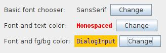

# swing-forms has moved!

The swing-forms library has been absorbed into [swing-extras](https://github.com/scorbo2/swing-extras) as
of the `2.0.0` release. **Any changes or enhancements to swing-forms will NOT be backported to this
repo!** Instead, all new development for swing-forms will be done in the `swing-extras` library.

The below documentation is left here for historical reasons. Have a nice day!

--------------------

## What is this?

This is swing-forms, a simple Java Swing library I originally wrote back in 2019 for use in various
side projects. It's proven useful to me a few times, mainly in saving me from having to write a lot
of manual GridBagLayout code, which I hate. With swing-forms you can very quickly stand up a form
with optional validation rules and with customizable Actions on each form field.

## Where do I get it?
With Maven, you can just list it as a dependency:

```xml
<dependencies>
  <dependency>
    <groupId>ca.corbett</groupId>
    <artifactId>swing-forms</artifactId>
    <version>1.9.1</version>
  </dependency>
</dependencies>
```

Or, you can clone this repo and build it locally:

```s
git clone https://github.com/scorbo2/swing-forms.git
cd swing-forms
mvn package  # Generates executable jar and javadocs
```

## What can I do with swing-forms?

The swing-forms library wraps most of the common input components into easy-to-use
wrapper classes and hides much of the complexity of using them. Included example
form field implementations are:

- Checkbox
- Color picker
- Combo box (editable and non-editable variants)
- File chooser
- Directory chooser
- Static label fields
- Number pickers (spinners)
- Text input fields (single-line and multiline supported)
- Panel fields (for rendering custom stuff)

You can use swing-forms to generate interactive forms in your Java Swing application
without writing a lot of manual layout code. The library comes with a simple demo
application which shows some example usages:


The introductory tab shown above was itself generated with swing-forms. Here we see
use of the LabelField to deliver mostly static text. These labels can be styled
into different colors, fonts, and sizes quite easily.


And here above we can see examples of some of the basic form fields. Such forms
can be generated in comparatively very few lines of code compared to their manual
GridBagLayout equivalents.

### Example code for a simple text input:

The code to generate a form with a simple text input field is quite simple:

```java
FormPanel formPanel = new FormPanel();
TextField textField = new TextField("Label:", 15, 1, true);
formPanel.addFormField(textField);
formPanel.render();
```

The TextField constructor takes the following parameters:

- Text to show in the field label
- Number of character columns for the text field (field width)
- Number of character rows for the text field (1 for single-line input)
- Whether the field should allow blank values or not

Once the TextField has been created, it can be added to a FormPanel via the
addFormField() method. And you don't have to write any manual layout code!

## Form validation

Form validation is optional, but is very easy to do with swing-forms. Often you want
to restrict certain fields so that they only allow certain values, or so that the
values in one field are only valid if some value in some other field is within a
certain range, etc. These rules are very easy to apply in swing-forms.

We've already seen in the code example above an example of a possible built-in
validation, and that is the last parameter to the TextField constructor. If you
tell the TextField not to allow blank values, then it will automatically add
a FieldValidator with that rule to itself. But you are not limited to built-in
validation capabilities with these fields! You can add new validation rules
very easily. First, let's use the built-in validation rule to tell the TextField
to not allow blank values:

```java
TextField textField = new TextField("Label:", 15, 1, false);
```

Note that we have set the final constructor parameter to false, meaning that we
don't want the field to accept blank values. What happens now when we try to
validate the form with a blank value in that field?


We see that the field fails validation, and we get a helpful tooltip message
from the red validation marker. The TextField itself added that FieldValidator
on our behalf because of the way we instantiated it.

But what if we want to add custom validation? This is quite easy!

```java
textField.addFieldValidator(new FieldValidator<FormField>(textField) {
    @Override
    public ValidationResult validate () {
        ValidationResult result = new ValidationResult();
        if (((TextField) field).getText().length() < 3) {
            result.setResult(false, "Text must be at least three characters!");
        }
        return result;
    }
});
```


Now we see our custom validation message is triggered if our own validation logic
determines that the field is invalid.

FormFields can have multiple FieldValidators attached to them. In this case, all
FieldValidators must report that the field is valid, otherwise the field will be
marked as invalid. If more than one FieldValidator reports a validation failure,
the validation messages will be concatenated together, like this:


Here we see both the built-in FieldValidator and our custom FieldValidator have both
reported a validation failure for the field in question. In this particular case,
the two messages are redundant. But, you can see how easy it is to apply multiple
validation rules to a FormField and have the FormPanel itself manage validating each
field and displaying messages as appropriate.

### Validating a form

FormPanel offers two equivalent methods for form validation:

- isFormValid() will validate the form and return a boolean indicating validation success.
- validateForm() will simply validate the form and return nothing.

Both of these methods will cause the validation success (green checkmark) or
failure (X marker) to appear beside each validatable field. Note that some
fields, like LabelField or CheckBoxField, do not subject themselves to
validation by default, as their contents are quite simple.

## Custom Actions

Often, it is useful to be able to perform some Action when the value in a
form field changes. For example, to show or hide other form fields depending
on the value in a combo box, or to perform some additional logic as soon
as a field value changes. This is also quite easy to achieve in swing-forms!

Let's start by defining a ComboField that has some basic options:

```java
List<String> options = new ArrayList<>();
options.add("This option has no extra settings");
options.add("This option has 1 extra setting");
options.add("This option has log of extra settings");

ComboField comboField = new ComboField("Show/hide extra fields:", options, 0, false);
formPanel.addFormField(comboField);
```

Then we can define some extra fields and hide them by default:

```java
CheckBoxField extraField1 = new CheckBoxField("Extra setting", false);
extraField1.setVisible(false);
formPanel.addFormField(extraField1);

TextField extraField2 = new TextField("Extra text field 1:", 10, 1, true);
extraField2.setVisible(false);
formPanel.addFormField(extraField2);

TextField extraField3 = new TextField("Extra text field 2:", 10, 1, true);
extraField3.setVisible(false);
formPanel.addFormField(extraField3);

TextField extraField4 = new TextField("Extra text field 3:", 10, 1, true);
extraField4.setVisible(false);
formPanel.addFormField(extraField4);
```

Now, we can add a custom Action onto our ComboField to show or hide the
extra fields depending on which combo option is selected:

```java
comboField.addValueChangedAction(new AbstractAction() {
    @Override
    public void actionPerformed (ActionEvent e){
        int selectedIndex = mainComboField.getSelectedIndex();
        extraField1.setVisible(selectedIndex == 1);
        extraField2.setVisible(selectedIndex == 2);
        extraField3.setVisible(selectedIndex == 2);
        extraField4.setVisible(selectedIndex == 2);
    }
});
```

The end result is that the "extra" fields will be shown or hidden as needed
at runtime, based on what you pick in the dropdown:


Above we see the difference between selecting the different combo options.
The "extra" fields that we have defined appear or disappear based on our
combo box selection. We can simply use the FormField's setVisible() method
in our custom Action to accomplish this!

## Custom FormFields - font chooser example

The included example FormField implementations will cover most simple form
input requirements. But inevitably, you may require some new type of FormField
to capture data that the built-in FormFields simply can't. For example,
a FontChooser component that allows selection of font, size, style,
and foreground/background color selection. Can we create a new custom form field
to do this with swing-forms? Yes we can!

 

We start by extending the FormField class and adding all the class properties that
we will need:

```java
public final class FontField extends FormField {

    private final JLabel sampleLabel;
    private final JButton button;
    private ActionListener actionListener;
    private Font selectedFont;
    private Color textColor;
    private Color bgColor;
    // ...
}
```

We can add some overloaded constructors to allow optionally setting an initial font, and optionally
specifying a starting text color and background color. If the color properties aren't specified,
we'll omit them from our font dialog and those properties won't be editable.

We also need to create our font chooser popup dialog. This is actually fairly easy because it
is in fact just another FormPanel! We can mostly use existing FormFields to create it. The exception
is our font family list chooser. We probably don't want to use a combo box here, as the list of 
installed system fonts might be quite large. It's easier to use a JList for this purpose, but we
currently don't have a FormField that wraps JList, so we have to write some manual code here.
Fortunately, it's not too difficult, as we can just wrap it in a PanelField:

```java
PanelField panelField = new PanelField();
JPanel panel = panelField.getPanel();
panel.setLayout(new BorderLayout());
fontListModel = new DefaultListModel<>();
fontList = new JList<>(fontListModel);
fontList.setSelectionMode(ListSelectionModel.SINGLE_SELECTION);
fontList.addListSelectionListener(e -> fontChanged());
JScrollPane scrollPane = new JScrollPane(fontList);
scrollPane.getVerticalScrollBar().setUnitIncrement(20);
panel.add(scrollPane, BorderLayout.CENTER);
formPanel.addFormField(panelField);
```

This is in fact why PanelField was created in the first place - to provide a way to wrap and house
any arbitrary UI components that aren't currently wrapped up in their own FormField implementation.

Okay, so we have an empty JList... how do we populate it with the list of fonts?

```java
switch (typeField.getSelectedIndex()) {
    case 0: // built-in fonts
      fontListModel.addAll(List.of(Font.SERIF, Font.SANS_SERIF, Font.MONOSPACED, Font.DIALOG, Font.DIALOG_INPUT));
      // ...
      break;
      
    case 1: // System fonts
      fontListModel.addAll(Arrays.asList(GraphicsEnvironment.getLocalGraphicsEnvironment().getAvailableFontFamilyNames()));
      // ...
      break;
}
```

The Java built-in fonts are those guaranteed to use by the JRE. These are the "safe" fonts.
The system-installed fonts we can retrieve from the local graphics environment. This list may
vary greatly from system to system and is beyond our control.

The next important step is to implement the render() method so that the field can draw itself.
Unfortunately, here we have to deal with GridBagLayout a little bit. But, swing-forms tries
to minimize this exposure by handing your method a GridBagConstraints object that you can
use as you go. Here's our render() method:

```java
@Override
public void render(JPanel container, GridBagConstraints constraints) {
  constraints.insets = new Insets(topMargin, leftMargin, bottomMargin, componentSpacing);
  constraints.gridy++;
  constraints.gridx = FormPanel.LABEL_COLUMN;
  fieldLabel.setFont(fieldLabelFont);
  container.add(fieldLabel, constraints);

  constraints.gridx = FormPanel.CONTROL_COLUMN;
  button.setPreferredSize(new Dimension(95, 23));
  button.setFont(selectedFont.deriveFont(12f));
  JPanel wrapperPanel = new JPanel();
  wrapperPanel.setBackground(container.getBackground());
  wrapperPanel.setLayout(new BoxLayout(wrapperPanel, BoxLayout.X_AXIS));
  wrapperPanel.add(sampleLabel);
  wrapperPanel.add(new JLabel(" ")); // spacer
  wrapperPanel.add(button);

  if (actionListener != null) {
    button.removeActionListener(actionListener);
  }
  actionListener = getActionListener(container);
  button.addActionListener(actionListener); // UTIL-147 avoid adding it twice

  constraints.fill = 0;
  constraints.insets = new Insets(topMargin, componentSpacing, bottomMargin, componentSpacing);
  container.add(wrapperPanel, constraints);
}
```

It is important to increment the `gridy` property straight away as we are starting a new
row on the form. We can make use of the various `COLUMN` constants provided by the
FormPanel class to control which component goes into which form column. Very basically,
we have a form column for field labels and a form column for the field itself. Behind the
scenes, there are some additional columns, but we rarely need to worry about them in 
a FormField's render implementation (but we can if we need to). 

We'll notice that the `CONTROL_COLUMN` here simply receives a `wrapperPanel`. What is this?
We don't have a single control to display in this column, but rather we have two - our
sample label and our action button. But our FormPanel only has one column for field controls. 
So, we have to wrap our multiple controls into one containing panel, and then add that panel 
in the `CONTROL_COLUMN`. This concept of wrapping multiple components into one wrapper
is very handy for wrapping up multiple controls into a single FormField.

We should also look at the ActionListener that we create for our button. It has to launch
our FontDialog and update our field values as needed, based on what the user picked.
Here we can also make use of the `fireValueChangedEvent()` method in the parent class:

```java
/**
 * Creates and returns a new ActionListener suitable for our form field.
 *
 * @param panel The owning panel (used to position the popup dialog)
 * @return An ActionListener that can be attached to a button.
 */
private ActionListener getActionListener(final JPanel panel) {
  return new ActionListener() {
    @Override
    public void actionPerformed(ActionEvent e) {
      FontDialog dialog = new FontDialog(panel, selectedFont, textColor, bgColor);
      dialog.setVisible(true);
      if (dialog.wasOkayed()) {
        setSelectedFont(dialog.getSelectedFont());
        setTextColor(dialog.getSelectedTextColor());
        setBgColor(dialog.getSelectedBgColor());
        fireValueChangedEvent();
      }
    }
  };
}
```

Triggering a value changed event will allow swing-forms to invoke any custom
Actions that have been registered on our custom form field. This allows other fields
to respond if they want to, based on whatever font the user has selected here.

The full code for `FontField` is included in this library and in
the demo application!

## License

swing-forms is made available under the MIT license: https://opensource.org/license/mit

## Revision history

The swing-forms library was originally written in 2019 as part of the `sc-util` project but
was not available on github until recently. Version `1.9.0` is the first publicly available
version of the library.

v1.9.1 [2025-04-10]
- https://github.com/scorbo2/swing-forms/issues/1 - Replace FontStyleField with FontField, which is better
- https://github.com/scorbo2/swing-forms/issues/2 - Add getFormField(id) to FormPanel
- https://github.com/scorbo2/swing-forms/issues/3 - (bug) FieldField.setEnabled() not working properly
- https://github.com/scorbo2/swing-forms/issues/4 - (bug) ComboField is using ItemListener carelessly
- https://github.com/scorbo2/swing-forms/issues/5 - Add an optional "?" icon for help text to each field
- https://github.com/scorbo2/swing-forms/issues/7 - PanelField should allow for validation
- https://github.com/scorbo2/swing-forms/issues/8 - updated README instructional guide
- https://github.com/scorbo2/swing-forms/issues/10 - FontField has optional size
